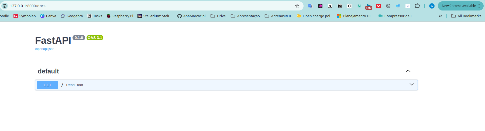

# DesenvolvimentoWebEstudos

pip install "fastapi[standard]"

fastapi dev api.py

http://127.0.0.1:8000/docs :

Saiba mais em : https://fastapi.tiangolo.com/#installation e https://fastapi.tiangolo.com/#license